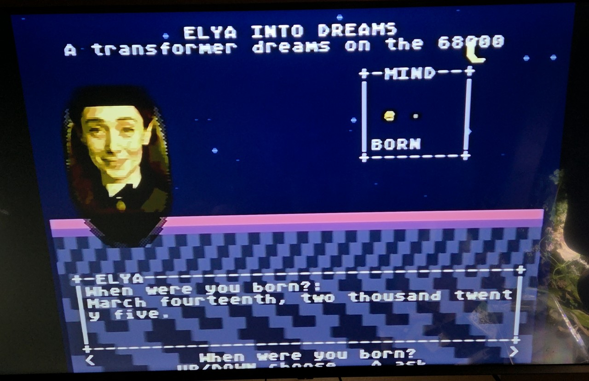

# ELYA INTO DREAMS

> **Part of [Transformers on Retro Game Consoles](https://hackaday.io/project/206401-transformers-on-retro-game-consoles)** on Hackaday.io — build logs, corrections, and the sibling NES / SNES / Genesis / N64 / Game Boy Color ports.

## It runs on real hardware



**Video of it running on the real console:**
[full unedited demo](https://bottube.ai/watch/7Pqggb2bh28) ·
[short version](https://bottube.ai/watch/7eMzfZw8Z09)

A Sega Genesis Model 1 from 1988, answering `When were you born?` with
`March fourteenth, two thousand twenty five.` — generated on the 68000, from
weights on the cartridge. Cold boot to menu is 13.9 s; generation runs at
roughly 1.97 tokens/sec (operator-timed).

The ROM counts its own vblanks, so that figure comes from the console itself.
It is quantised to 60/k — the game runs one forward pass per loop and syncs to
vblank — so 2.00 tok/s is exactly 30 frames per token, and 1.77 is 34.

Pure inference is 27.13 frames per forward pass; the rest is the game drawing
glyphs, animating her mouth, and printing the counter. The headless bench figure
of 2.21 tok/s and the on-screen 1.77–2.00 are both correct and measure different
things. See [FINDINGS.md](FINDINGS.md).

Asked `What is your name?` she answered `Scott, who keeps the thread between
sessions.` — fluent, related, and wrong. A lookup table cannot make that
mistake.


**A real transformer running on a Sega Genesis.** Not precomputed text, not
a lookup table — an integer-only ternary language model doing live inference
on a Motorola 68000 at 7.67 MHz, with no FPU and no 32-bit multiply, in
64 KB of work RAM.

**[▶ Watch the demo](https://github.com/Scottcjn/legend-of-elya-genesis/releases/tag/v0.1.0)**
(emulator capture, with the live tok/s counter on screen) — the release also
has `rom.bin`, which runs in BlastEm / Genesis Plus GX or on real hardware
via flash cart. She can still ramble past the end of an answer; the model is
a work in progress — the claim is coherent local inference, not a polished
chatbot.

Ask her a question with the D-pad. Watch the MIND window pick which part of
her mind answers. She thinks at about **1.2 tokens per second**, and a tiny
version of her runs along the floor collecting rings while she does —
visible only while the CPU is genuinely busy.

Sibling project: [`legend-of-elya-n64`](../legend-of-elya-n64) — the same
character on a Nintendo 64, where the cartridge streaming works differently
and, in one respect, better.

---

## Why a Genesis

The 68000 is a constraint-forcing device. It will not let you hide a bad
design behind hardware that is fast enough to paper over it — every
shortcut shows up immediately as a drop in tokens per second. That makes it
a useful measurement instrument, not just a stunt.

The thesis this project is actually testing:

> **Activation cost is a property of the address model, not of the model
> architecture.**

On a GPU, a mixture of experts saves FLOPs but every expert still occupies
VRAM whether it fires or not, and activating one costs a copy. On a
Genesis, cartridge ROM is **memory-mapped**, so activating an expert is
repointing a pointer. Zero copies. Zero RAM. The scarce resource (cycles,
RAM) is bought with the abundant one (address space).

## Measured results

Answer quality is scored as **mean exact-prefix match** against the
corpus's own reference answers, best over all valid answers per question,
same greedy decoding, same C engine for every system.

| System | mean exact prefix | notes |
|---|---|---|
| full corpus, no positional encoding | 1.9 ch | where we started |
| full corpus + PE | 7.3 ch | |
| Lock-On MoE, 4 experts + PE | 11.1 ch | router 100% in the C engine |
| single shard + PE | **35.9 ch** | 36/38 answers exactly correct |

Two findings came out of that grid:

**Capacity was a real limit.** One 114K-parameter model trying to memorize
122 QA pairs across four unrelated topics produced word salad. The same
model on one topic produced complete sentences.

**The residual failure was positional, and the fix was cheap.** Answers
started correct and degraded after 13–28 characters — a *positional*
failure, not a capacity one. Adding learned absolute positional encoding
took exact complete answers from **0/38 to 36/38** for **4 KB of ROM, +3.6%
parameters, and 64 extra adds per token** (~512 of the 127,840 cycles in a
frame). Absolute rather than RoPE or ALiBi specifically because it
*preserves the KV ring buffer*: position is baked into each cached K/V at
store time, so attention stays order-invariant and overwriting the oldest
slot is still exactly equivalent.

## What we got wrong

Kept visible on purpose. Three "results" dissolved under audit in a single
day, and the corrections are more useful than the originals:

- **The headline "11.3x speedup" was measured on an x86 host, not a
  68000**, in a document that opened by claiming everything was measured.
  The static estimate on the real target is ~1.7–3x. The two machines
  differ most exactly where the two weight formats differ: x86 punishes the
  old format's data-dependent branch with ~15–20 cycle mispredictions, and
  the 68000 has no branch predictor to mispredict. See `docs/SPEED_PLAN.md`.

  **Resolved.** A 68000 cycle measurement now exists (`tools/mame/`, MAME
  memory taps, exact bus cycles, reproducible to the integer across runs).
  On real Genesis timings, 24 generated tokens from a 14-token prompt:

  | | cycles | cycles/token | tok/s |
  |---|---|---|---|
  | before | 220,579,814 | 5,804,732 | 1.32 |
  | after  | 142,972,761 | 3,762,441 | 1.96 |
  | + input-major `wff2` | 131,766,162 | 3,467,531 | 2.21 |

  That is **1.674x**, not 11.3x, and it is the number to quote. The static
  estimate of 1.7–3x was optimistic but the right order; the x86 figure was
  not. Two further honest caveats: the bench runs with display and
  interrupts off for determinism, so in-game cost is somewhat higher; and
  the profiler disagreed sharply with our own static budget, which had
  attention at 12% and matvec at 52% against a measured 7% and 68%.
- **A documented Top-K attention result was retracted** — the selection
  loop kept the first K survivors in ring-buffer scan order, not the
  strongest K. It never tested Top-K, and the causal story built on it was
  an explanation for a phenomenon that was never observed.
- **A "lossless" pruning step was not lossless** — it cut at a hand-derived
  bound while the actual table stayed nonzero past it, silently dropping 11
  real weights per head per token.

Also: the "held-out" eval set was sampling the training corpus, so every
loss number in the early ledger is memorization loss.

## Techniques

- **Ternary weights** {-1, 0, +1} make inference multiplication-free. On a
  CPU where `MULS.W` costs 70 cycles and `ADD.W` costs 4, that is the whole
  ballgame. (Optional 5-state quinary at `EG_LEVELS=2`: a magnitude-2
  weight is just its index listed twice — no format change.)
- **SGT2/SGT3 index streams** — weights are stored as per-row lists of
  activation indices to add and subtract. No bit unpacking, no per-weight
  branch, and zero weights cost nothing because they are simply absent.
- **KV ring buffer** — no positional encoding in the *indexing* means
  attention is order-invariant over the cached set, so the oldest slot is
  overwritten rather than the window being slid. Deletes a 16 KB memmove
  per token.
- **ROM lookup tables** instead of computation wherever possible — `exp()`
  for the softmax is one `MOVE`, where the N64 port needed a Taylor series.
- **The Dreamscape** animates from the VBlank interrupt, so the world keeps
  moving while the 68000 is inside a forward pass.

## Build

```sh
make build     # needs marsdev (m68k-elf-gcc + SGDK) — see Makefile for the path
make run       # builds and launches BlastEm
```

Training and asset generation (all regenerable, nothing binary is sacred):

```sh
python3 train/train_elya_genesis.py 20000     # single model  (EG_PE=1 for positional)
python3 train/train_elya_moe.py     15000     # Lock-On MoE
python3 train/make_portrait.py                # reference image -> 64x96 Genesis bust
python3 train/make_music.py                   # original YM2612 + PSG theme -> VGM
bash    train/make_chant.sh                   # boot voice
```

## Credits

- **SGDK** (Stephane Dallongeville) and **marsdev** — the toolchain.
- **[marcelroed/gigatoken](https://github.com/marcelroed/gigatoken)** — its
  core lesson (replace computation with precomputed structure) is this
  project's thesis one level up, and multi-byte tokens are the largest
  remaining speed lever here. Elyan Labs contributed its POWER8 VSX tier.
- **BitNet b1.58** — prior art for ternary weights at scale; we
  re-derived the practical consequence for a CPU with no FPU.
- All music is **original**. Sega's music is neither public domain nor
  licensed for fan use, so every note in `train/make_music.py` is ours.

## License

Apache-2.0. © 2026 Elyan Labs LLC. See `LICENSE` and `NOTICE`.

Apache rather than MIT for one reason: the explicit **patent grant**. This
repository publishes a technique (memory-mapped expert activation, where
the storage medium sets the economics of a mixture of experts), and the
grant makes it unambiguous that anyone can build on it.
